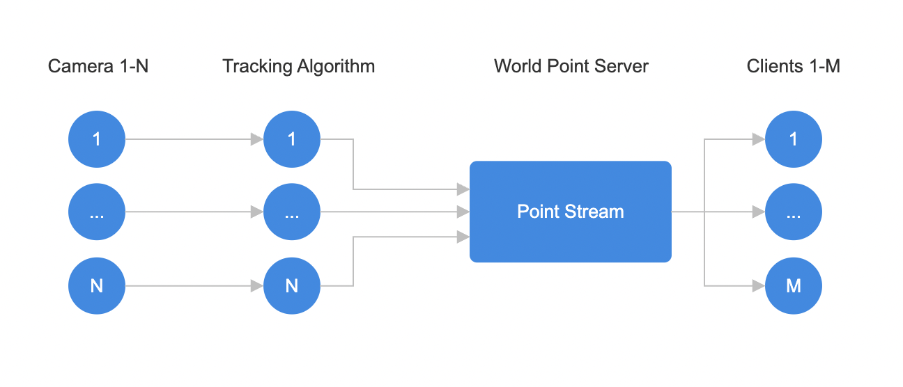

# TrafficCamWatcher

Implementation of vehicle localization using visual odemetry. Given a camera's latitude/longitude, estimated rotation, and image to world point mappings, reconstruct real world positions of traffic within a given video stream. These algorithms have wide ranging applications within smart city and transportation systems such as vehicle counting, lane usage, and traffic indident detection.

# Single Camera

Currently supports Real-Time 15fps camera stream and up to 10 seperately tracked moving objects with minimal performance issues

# Multi Camera, Single Map Support

Can configure multiple cameras based on the cameras.json file. Testing up to this point has shown the performance bottleneck is within each camera, and depends on how backed up any stream may be given how many objects are currently being tracked

